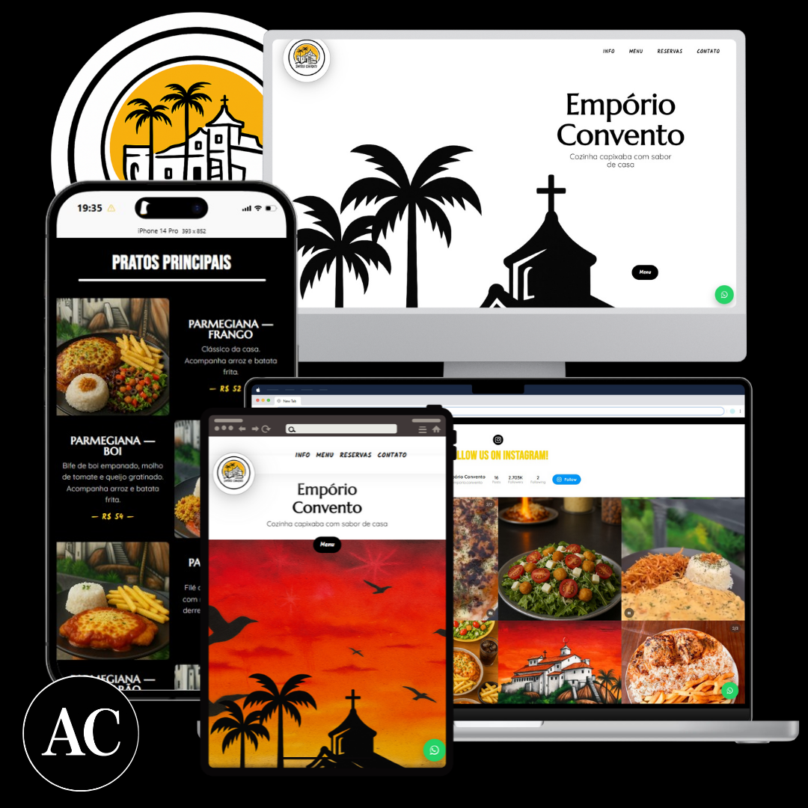

# Empório Convento — Landing Page

Landing page **mobile-first** para Empório Convento orientada a **conversión** (reservas y pedidos por WhatsApp).  
Incluye héroe ilustrado, menú en zig-zag, galería, módulo de reservas, bloque de Instagram, mapa y **CTA flotante de WhatsApp**.

---

## Features

- **Hero interactivo** con animaciones suaves (ilustración en destaque + CTA)
- **Navbar sticky** animada con subrayado fluido en los links
- **Secciones en Zig-Zag** para menú digital (entradas, platos principales, etc.)
- **Galería animada en marquee** (scroll automático y GPU-friendly)
- **Formulario de Reservas** integrado a **WhatsApp**
- **Botón flotante de WhatsApp (FAB)** siempre visible
- **Integración con feed de Instagram** (fotos y videos)
- **Páginas legales**: Política de Privacidad & Cookies
- **Mapa embebido (Google Maps)** en contacto

---

## Tecnologías

- **HTML5** — estructura semántica  
- **CSS3** — responsive con `clamp`, `grid` y media queries  
- **JavaScript (ES6)** — interactividad y animaciones  
- **Intersection Observer API** — revelar elementos al hacer scroll  
- **WhatsApp API** — reservas/pedidos por mensaje  
- **Google Maps Embed** — ubicación  
- **Instagram Embed/Feed** — prueba social

---

## Estructura

│── index.html
│── /css
│ ├── styles.css
│ └── legal.css
│── /js
│ └── main.js
│── /img
│ ├── icon/
│ ├── insta/
│ └── preview/
│ ├── EmporioConventoMockup1.png
│ ├── EmporioConventoMockup2.png
│ └── EmporioConventoMockup.mp4
│
│── politica-privacidade.html
│── politica-cookies.html
└── README.md

## Breakpoints (sin interferencias)

El proyecto separa estilos por rangos para evitar solapes entre “móvil grande” y “tablet”:

- **XS**: `@media (max-width: 399px)`
- **Mobile**: `@media (min-width: 400px) and (max-width: 767px)`
- **Tablet**: `@media (min-width: 768px) and (max-width: 1023px)`
- **Desktop**: `@media (min-width: 1024px) and (max-width: 1439px)`
- **XXL**: `@media (min-width: 1440px)`

## Preview

<!-- Usa una imagen real (mockup/screenshot), no la URL del sitio -->

  

  

  
<strong>🎬 Ver video MP4 (click para desplegar)</strong>

  

    <video src="https://github.com/amandaceereja/emporio-convento-landing/blob/main/img/preview/EmporioConventoMockup.mp4?raw=1"
           controls muted playsinline style="max-width:100%; height:auto; border-radius:12px; outline:none;">
      <source src="img/preview/EmporioConventoMockup.mp4" type="video/mp4">
      Tu navegador no soporta video embebido.
    </video>
  

  

    Si no ves el reproductor, abre el video directamente:
    <a href="https://github.com/amandaceereja/emporio-convento-landing/blob/main/img/preview/EmporioConventoMockup.mp4?raw=1">raw MP4</a>
  

---
## Live Demo

https://amandaceereja.github.io/emporio-convento-landing/

Sitio estático desplegado con GitHub Pages.

## License

Este proyecto fue desarrollado con fines educativos y de portafolio.
Puedes utilizarlo y adaptarlo libremente, pero el uso comercial sin autorización está prohibido.

## Author

Desarrollado por: Amanda Cereja
GitHub: @amandaceereja

Contacto: amandacereja027@outlook.com
